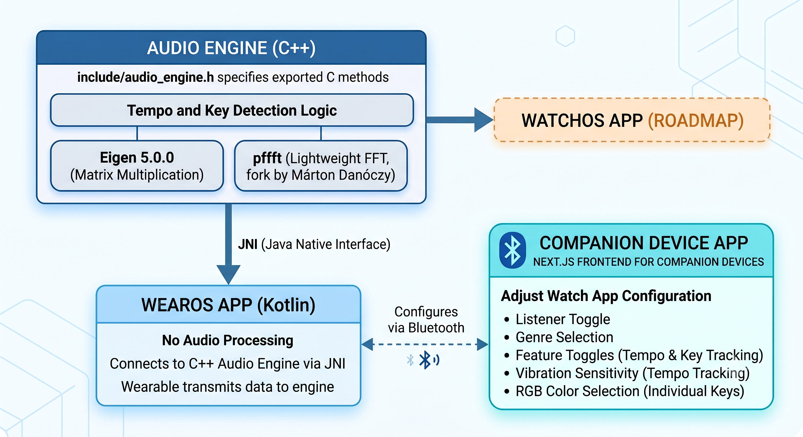

# WearingAid: A Wearable Approach to Supporting Deaf Musicians in Bands

## What
A WearOS (perhaps eventual expansion to watchOS) application for Deaf musicians in live performance scenarios.

## Why
Bands rely on auditory cues to ensure they stay in time with their bandmates and change keys on time, especially in improvised scenarios like jazz. However, members of the Deaf community likely struggle to hear their bandmates while performing, with substantial ambient noise inhibiting audition in certain venues and the transition between changing keys being more challenging to interpret due to perceived loudness discrepancies. This project seeks to address these challenges by providing an accessible tool that Deaf band members, irrespective of their instrument of choice, can install for assistance in live music scenarios.

## Architecture
**companion/** contains the Next.js frontend for companion devices to adjust the watch app's configuration. Companion-supported configuration details include a listener toggle, genre selection, feature toggles for tempo and key tracking, vibration sensitivity for tempo tracking, and RGB color selection for individual keys.

**wearos/** contains the WearOS implementation. It is written in Kotlin and connects to the C++ audio engine via the Java Native Interface (JNI). No audio processing occurs in this folder.

**audio-engine/** contains the C++ logic that powers tempo and key detection. `include/audio_engine.h` specifies the methods, exported in C for simplicity, that the wearable employs to transmit data to the engine. Additionally, this engine utilizes the following third party libraries:
- Eigen 5.0.0: Efficient matrix multiplication
- pffft: A fork of Julien Pommier's Pretty Fast FFT (PFFFT) library by Márton Danóczy ([github](https://github.com/marton78/pffft)); lightweight, wearable-ready fast fourier transforms


## Architectural Decisions
### Why PFFFT?
- pffft automatically detects ARM NEON to run instructions with SIMD, and ARM architecture is predominant in the smartwatch market. pffft is the natural choice for a wearable-first approach
### Why not run inference on the companion?
1. **Companion is recommended, not required:** If I required inference to occur on the companion device, having a companion in the first place would be mandatory. I sought to make this application wearable-first.
2. **BLE:** the default ~20 byte packet limit (a 23 byte ATT MTU minus a 3 byte header) prevents constant audio/detection result transfer between watch and companion.
3. **UDP:** Even if I decided against BLE and employed UDP, the constant stream would tank the battery of most smartwatches. A constant rich stream is impractical for most real-world live-music cases.
### Why not bundle the audio engine with the WearOS implementation?
I decided to develop the audio engine separately from the WearOS application for potential future watchOS support. Both applications would employ the same engine in their respective frontend.
### What optimizations do you make to minimize latency?
1. Microphone buffers are handed straight from the Oboe callback into the C++ engine, so there is no per-buffer JNI marshaling and no audio processing in the Kotlin layer. Detection results are passed back across threads with lock-free atomics, and the FFT setups and buffers are allocated once and reused, so nothing allocates on the audio path.
2. The WearOS application streams provides raw audio to the engine via Google Oboe ([github](https://github.com/google/oboe)), which is a C++ library designed for high-performance, low-latency audio applications on Android. It is the newest Android standard for this kind of application.
### How does the audio engine work?


1. **Key detection:**
   - **HMM Filter:** Hidden Markov Model (HMM) since key changes typically follow the circle of fifths.
   - **Pearson Correlation:** Pre-computes mean-centered and L2-normalized key profiles to penalize energy where the key profile expects silence.
   - **Transition Prior:** Emphasizes circle-of-fifths neighbors, relative major/minor, and parallel keys over distant modulations.
   - **Parabolic Interpolation:** Accumulates energy exclusively from local maxima with parabolic interpolation. This prevents broadband noise from dominating the spectrum, allowing for much more robust binning of bass frequencies.
   - **Drone Rejection & Pitch-Grid Gate:** Subtracts stationary tones (e.g., AC hum) using a leaky `drone_mag` floor, and employs a pitch-grid gate to drop frequencies over 35 cents off from a true semitone.
   - **Haptic Suppression:** Utilizes `chroma_contaminated` flags and `HAPTIC_SUPPRESS_FRAMES` to completely skip analysis windows that are contaminated by the tempo tracking vibration motor buzz.
   - **Robust Logcat:** Emits clear diagnostic states (including starved window tracking for haptic suppression).

2. **Tempo tracking:**
   - **Masked Autocorrelation:** Increases the masked autocorrelation envelope size and actively cancels out motor buzz by feeding `0` (buzz) or `1` (content) masks from the `env_mask` into the correlation.
   - **Subdivision Support:** Addresses eighth notes by forbidding an artificially fast tempo (e.g., 144 BPM) from borrowing correlation from a slower tempo (72 BPM). Actively rewards eighth note subdivisions with a bonus to favor the true main beat (72 BPM).
### What is the impact of genre selection?
Each genre corresponds with a different key profile in the audio engine. The engine matches the detected chroma against the selected profile to identify the key, and they differ because different genres emphasize scale degrees differently (for instance, electronic music leans heavily on the tonic and fifth, while jazz and classical voicings spread weight across more of the scale). Profile-specific implementation inspired by Dr. Emilia Gómez Gutiérrez's doctoral dissertation, TONAL DESCRIPTION OF MUSIC AUDIO SIGNALS. Profiles derived from the Music Technology Group - Universitat Pompeu Fabra's Essentia library ([github](https://github.com/MTG/essentia/blob/master/src/algorithms/tonal/key.cpp)).

### Evaluation

To test the system's accuracy, I analyzed four songs with well-known BPM and key signatures. I fed the raw audio files (`.wav`) into the standalone C++ testing script (`main.cpp`) to measure the baseline DSP performance without microphone or ambient noise contamination. The script was executed via `./build/test_engine ../test-wav/{song-name}.wav`.

#### Results
| Song | Genre Profile | Ground Truth | Key Analysis | Tempo Analysis |
| :--- | :--- | :--- | :--- | :--- |
| **"Let It Be"** - The Beatles | Band | C Major, ~72 BPM | 95.0% (228/240) as C Major | 72.5% (145/200) within ±3 BPM |
| **"Through the Wire"** - Kanye West | Band | G Major, ~83 BPM | 10.0% G Major, 70.8% A Minor (relative minor conflation due to ii chord) | 98.6% (216/219) within ±3 BPM |
| **"House of the Rising Sun"** - The Animals | Band | A Minor, ~117 BPM | 94.4% (251/266) as A Minor | 12.0% (32/266) within ±3 BPM (due to rolling arpeggios) |
| **"Fly Me to the Moon"** - Frank Sinatra | Classical | C Major, ~120 BPM | 18.0% (25/139) as C Major | 17.3% (24/139) within ±3 BPM (due to swung rhythm) |

#### Live App Demonstrations
Below are demonstrations of the WearOS app running these songs live. When tested through the smartwatch microphone in a real-world acoustic environment, the app exhibited the following behaviors:

- **"Let It Be":** Started at A minor (~72 BPM) before quickly converging to the correct C major key. The BPM fluctuated heavily for a few seconds at a time (spiking from ~70 BPM to 171 BPM at one point) before settling back down. This turbulence is likely due to the engine transiently locking onto dense eighth-note piano subdivisions before accumulating enough correlation to restore the slower main beat.
- **"Through The Wire":** Found A minor almost immediately. The BPM started at 60 but quickly locked onto a steady ~80 BPM. This behavior closely mirrored the pristine non-mic baseline test.
- **"House of the Rising Sun":** Quickly converged to A minor. The tempo started at ~122 BPM, dropped to oscillate between 70-90 BPM, and eventually stabilized at ~116 BPM. This dynamic convergence actually outperformed the non-mic baseline test for tempo lock!
- **"Fly Me to the Moon":** The key detection was inconclusive, rapidly fluctuating between several localized chords (including F major, E minor, etc.) due to the dense jazz harmony. However, the BPM stabilized around 62 BPM—exactly half of the 120 BPM expected. This is a classic "octave error" where the autocorrelation confidently locked onto the half-time pulse of the swung rhythm.

**Let It Be:**
<iframe src="https://drive.google.com/file/d/1f50dHbEwhEggmE_zCyphUnJVA0F1GH2Y/preview" width="560" height="315" allow="autoplay" allowfullscreen></iframe>

**Through The Wire:**
<iframe src="https://drive.google.com/file/d/1J15Ej1V2ObiOewarDm58n8Sb75hVmhyH/preview" width="560" height="315" allow="autoplay" allowfullscreen></iframe>

**House of the Rising Sun:**
<iframe src="https://drive.google.com/file/d/1PVXctTOcbchftSdu7lfpsDURxADuPkjX/preview" width="560" height="315" allow="autoplay" allowfullscreen></iframe>

**Fly Me to the Moon:**
<iframe src="https://drive.google.com/file/d/1houBGtidxM9d2vcZMTbkBrlx2yObt9lC/preview" width="560" height="315" allow="autoplay" allowfullscreen></iframe>

## Build Instructions

To build the standalone C++ audio engine for local testing:
```bash
cd audio-engine
rm -rf build
mkdir build && cd build
cmake ..
make
```

### Known Limitations
1. **Tempo Stabilization & Octave Errors:** The tempo tracker requires several seconds of buffered audio to lock onto a steady beat. Despite active subdivision weighting, passages with dense eighth-note rhythms or complex syncopation can occasionally induce transient "octave errors" (e.g., temporarily jumping to 144 BPM instead of 72 BPM) before the algorithm re-stabilizes.
2. **Local Chord Tracking vs. Global Key:** The key detection algorithm evaluates a short-term smoothed chromagram. Consequently, it may sometimes track localized chord progressions rather than retaining the overarching structural key of the song.
3. **Major/Minor Ambiguity:** The engine occasionally conflates relative major and minor keys (e.g., C Major and A Minor). Because relative keys share the exact same pitch classes, the algorithm can briefly flip between them depending on which specific chords the band is emphasizing in the current phrase.

### Evaluation

To test this system's accuracy, I ran the application against four songs with well-known BPM and key signatures, and then I ran the same songs in .wav through the test script in `main.cpp`, which can be run with `./build/test_engine ../test-wav/{desired-file-name.wav}`. Below are my observations and results.

Tests:
- 1. "Let it Be" - the Beatles. Tested genre class: Band
   - This song is in C major at approximately 72 BPM.
   - analysis, compare to the non-mic eval. Non mic eval, 145/200 or roughly 60.4% of classifications throughout the song are +- 3 of 72 BPM, with the number of temistamps being based on the number of seconds mimuns key suppression due to temporal vibration. 228/240 or 95% are C major. 
- 2. "Through the Wire" - Kanye West. Tested genre class: Band
   - This song is in G major at approximately 83 BPM. Non mic eval
   - analysis, compare to the non-mic eval. Non mic eval, or roughly 98.6% are within +-3 of 83 BPM. 22/219 or ~10% are G major. However, 155/219 or ~70.8% are A minor and online world often classifies THrough teh Wire as A minor.
- 3. "House of the Rising Sun" - The Animals. Genre class: Band
   - This song is in A minor at approximately 117 BPM.
   - analysis, compare to the non-mic eval. 251/266, or roughly 94.4%, are A minor. 32/266, or roughly 12.0%, are +-3 of 117 BPM.
- 4. "Fly Me to the Moon" - Frank Sinatra. Genre class: Classical
   - This song is in C major at approximately 120 BPM.
   - analysis, compare to the non-mic eval. 25/139, or roughly 18.0% are C major, 24/139, or roughly 17.3% are +- 3 of 120

Test Videos:
EMBED THE VIDEOS HERE. YOU WILL SEE THEM IN DOCS WITH CORRESPONDING FILE NAMES
## add build instructions
in audio-engine: rm -rf build
mkdir build && cd build
cmake ..
make